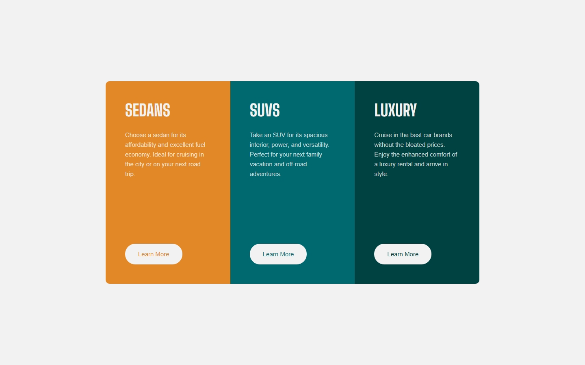
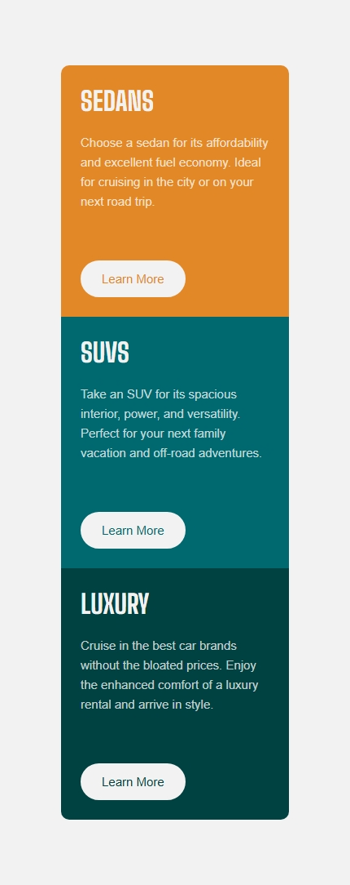

# 3-Column Preview Card Component

A responsive card component solution for the [Frontend Mentor challenge](https://www.frontendmentor.io/challenges/3column-preview-card-component-pH92eAR2-). This project showcases modern CSS techniques including Flexbox, responsive design, and hover effects.

## Table of Contents

- [Screenshots](#-screenshots)
- [Features](#-features)
- [Built With](#️-built-with)
- [Responsive Breakpoints](#-responsive-breakpoints)
- [Design Specifications](#-design-specifications)
- [Getting Started](#-getting-started)
- [Project Structure](#-project-structure)
- [Key Learning Points](#-key-learning-points)
- [Browser Support](#-browser-support)
- [Author](#-author)
- [License](#-license)

## 📸 Screenshots

### Desktop View


### Mobile View


## 📋 Features

- **Responsive Design**: Optimized for mobile, tablet, and desktop screens
- **Interactive Elements**: Hover effects on buttons with smooth transitions
- **Modern CSS**: Uses Flexbox for layout and HSL color values
- **Accessibility**: Semantic HTML structure and proper contrast ratios
- **Cross-browser Compatible**: Works across all modern browsers

## 🛠️ Built With

- **HTML5**: Semantic markup structure
- **CSS3**: Advanced styling with modern features
  - CSS Flexbox for layout
  - CSS Custom Properties (HSL colors)
  - Media queries for responsive design
  - Smooth transitions and hover effects
- **Google Fonts**: Lexend Deca and Big Shoulders Display

## 📱 Responsive Breakpoints

- **Desktop**: 1440px (design width)
- **Tablet**: 768px and below
- **Mobile**: 480px and below (375px design width)

## 🎨 Design Specifications

### Colors
- **Sedan Card**: `hsl(31, 77%, 52%)` (Orange)
- **SUV Card**: `hsl(184, 100%, 22%)` (Cyan)
- **Luxury Card**: `hsl(179, 100%, 13%)` (Dark Green)
- **Background**: `hsl(0, 0%, 95%)` (Light Gray)
- **Text**: `hsla(0, 0%, 100%, 0.75)` (Transparent White)

### Typography
- **Headers**: Big Shoulders Display (700 weight)
- **Body Text**: Lexend Deca (400 weight)
- **Font Size**: 15px base

## 🚀 Getting Started

1. Clone or download the project
2. Open `index.html` in your browser
3. View the responsive design by resizing your browser window

## 📁 Project Structure

```
3-column-preview-card-component/
├── index.html
├── css/
│   └── styles.css
├── images/
│   └── favicon-32x32.png
├── README.md
```

## 🎯 Key Learning Points

- **Flexbox Layout**: Using `flex: 1` for equal-width columns
- **Responsive Design**: Mobile-first approach with media queries
- **CSS Transitions**: Smooth hover effects on interactive elements
- **Color Management**: Using HSL color values for better color control
- **Typography**: Implementing custom Google Fonts effectively

## 🌐 Browser Support

- Chrome (latest)
- Firefox (latest)
- Safari (latest)
- Edge (latest)

## 👨‍💻 Author

**Abdullah**
- GitHub: [@abdullah09c](https://github.com/abdullah09c)
- Frontend Mentor: [@abdullah09c](https://www.frontendmentor.io/profile/abdullah09c)

## 📝 License

This project is part of a Frontend Mentor challenge and is for educational purposes.

---

**Frontend Mentor** - [@abdullah09c](https://www.frontendmentor.io/profile/abdullah09c)
